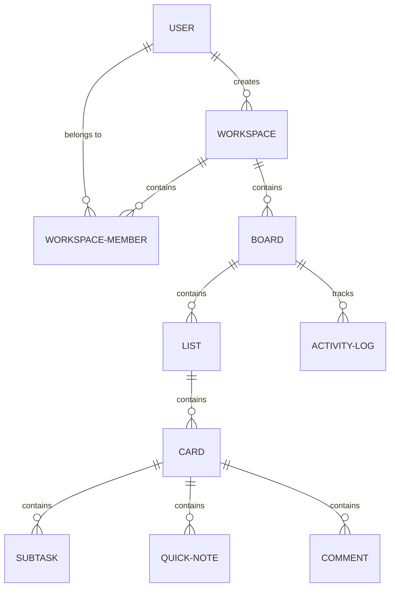

# TNotes Teams Web — Architecture Design

This document details the architecture, data modeling, API design, real-time collaboration topology, and offline sync mechanics for **TNotes Teams Web**.

---

## 1. System Topology Overview

```
                      +------------------------------------+
                      |          Client (Browser)          |
                      |  React + TS + Zustand + IndexedDB  |
                      +------------------------------------+
                                 |              ^
                 REST (JSON) API |              | WebSockets (Real-time)
                                 v              v
                      +------------------------------------+
                      |       Go API & WS Backend          |
                      |    Chi Router + WebSocket Hub      |
                      +------------------------------------+
                         |             |             |
                 Ent ORM |             | sqlc (SQL)  | Pub/Sub
                         v             v             v
                    +------------+ +-----------+ +-----------+
                    | PostgreSQL | | PostgreSQL | | Go In-Mem |
                    | (Schema)   | | (Queries)  | | Pub/Sub   |
                    +------------+ +-----------+ +-----------+
```

---

## 2. Database Schema & Data Modeling

We use **Ent** for the core entity schema definition and relationships, and **sqlc** for executing fast, compile-time type-checked raw queries (primarily for bulk fetches, reporting, and offline sync processing).

### 2.1 Entity Schema Definitions (Ent)

The entity relationships are defined as follows:



1. **User** (`users`): Represents users of the platform.
   - `id` (UUID, PK)
   - `email` (String, Unique)
   - `username` (String, Unique)
   - `password_hash` (String, Sensitive)
   - `avatar_url` (String, Optional)
   - `created_at` / `updated_at`

2. **Workspace** (`workspaces`): A team sandbox containing boards and members.
   - `id` (UUID, PK)
   - `name` (String)
   - `description` (String, Optional)
   - `theme_color` (String, e.g. `#6366F1`)
   - `created_by` (UUID, FK to User)
   - `created_at`

3. **WorkspaceMember** (`workspace_members`): Join table for workspace membership and RBAC.
   - `workspace_id` (UUID, PK/FK)
   - `user_id` (UUID, PK/FK)
   - `role` (Enum: `admin`, `member`, `viewer`)
   - `joined_at`

4. **Board** (`boards`): The Kanban board workspace.
   - `id` (UUID, PK)
   - `workspace_id` (UUID, FK)
   - `name` (String)
   - `description` (String, Optional)
   - `color_theme` (String, e.g. `#6366F1`)
   - `is_archived` (Boolean)
   - `created_by` (UUID, FK to User)
   - `created_at` / `updated_at`

5. **List** (`lists`): Columns on a Board.
   - `id` (UUID, PK)
   - `board_id` (UUID, FK)
   - `title` (String)
   - `position` (Integer, for ordering)
   - `created_at`

6. **Card** (`cards`): Task cards.
   - `id` (UUID, PK)
   - `list_id` (UUID, FK)
   - `title` (String)
   - `description` (String, Optional)
   - `position` (Integer, for ordering)
   - `due_date` (Timestamp, Optional)
   - `labels` (JSON array of strings)
   - `progress_percentage` (Integer, 0-100, computed from subtasks)
   - `created_by` (UUID, FK to User)
   - `created_at` / `updated_at`

7. **Subtask** (`subtasks`): Checklist items in cards.
   - `id` (UUID, PK)
   - `card_id` (UUID, FK)
   - `title` (String)
   - `is_completed` (Boolean)
   - `position` (Integer)
   - `created_at`

8. **QuickNote** (`quick_notes`): Inline persistent notes inside cards.
   - `id` (UUID, PK)
   - `card_id` (UUID, FK)
   - `content` (Text)
   - `created_by` (UUID, FK to User)
   - `created_at` / `updated_at`

9. **Comment** (`comments`): User comments on cards.
   - `id` (UUID, PK)
   - `card_id` (UUID, FK)
   - `user_id` (UUID, FK)
   - `content` (Text)
   - `created_at`

10. **ActivityLog** (`activity_logs`): Board-scoped audit trail.
    - `id` (UUID, PK)
    - `board_id` (UUID, FK)
    - `user_id` (UUID, FK, Optional)
    - `action` (String, e.g., `card_moved`)
    - `entity_type` (String, e.g., `card`)
    - `entity_id` (UUID)
    - `old_value` (JSON)
    - `new_value` (JSON)
    - `created_at`

### 2.2 sqlc Compile-Time Query Execution

We configure `sqlc` to generate Go queries for performance-critical and complex SQL operations:
- **Board Full Export**: Recursive json aggregation of board -> lists -> cards -> subtasks, quick notes, and comments to allow single-query exports.
- **Activity Log Reader**: Efficient paginated querying of audit records.
- **Workspace Member Lookups**: High-throughput validation queries for auth and RBAC checks.
- **Reordering updates**: Shift position updates in bulk when drag-and-drop operations occur.

---

## 3. API Surface (REST & WebSockets)

### 3.1 REST API Endpoints

#### Authentication
- `POST /api/auth/register` - Registers a new user. Returns JWT token.
- `POST /api/auth/login` - Authenticates user. Returns JWT token.
- `GET /api/auth/me` - Validates JWT and returns current user info.

#### Workspaces
- `GET /api/workspaces` - List user's workspaces.
- `POST /api/workspaces` - Create new workspace (creator is Admin).
- `GET /api/workspaces/{workspaceID}` - Retrieve workspace details.
- `POST /api/workspaces/{workspaceID}/members` - Invite member by email (Admin-only).
- `PUT /api/workspaces/{workspaceID}/members/{userID}` - Update member role (Admin-only).
- `DELETE /api/workspaces/{workspaceID}/members/{userID}` - Remove member (Admin-only).

#### Boards
- `GET /api/workspaces/{workspaceID}/boards` - List workspace boards.
- `POST /api/workspaces/{workspaceID}/boards` - Create board (Member+).
- `GET /api/boards/{boardID}` - Retrieve board state with all lists, cards, subtasks, notes.
- `PUT /api/boards/{boardID}` - Update board settings (color_theme, is_archived, name) (Member+).
- `DELETE /api/boards/{boardID}` - Delete board (Admin-only).

#### Lists
- `POST /api/boards/{boardID}/lists` - Create column (Member+).
- `PUT /api/lists/{listID}` - Update title/position (Member+).
- `DELETE /api/lists/{listID}` - Delete column (Member+).

#### Cards
- `POST /api/lists/{listID}/cards` - Create card (Member+).
- `PUT /api/cards/{cardID}` - Update title, description, labels, due date, position, or list (Member+).
- `DELETE /api/cards/{cardID}` - Delete card (Member+).

#### Subtasks, Notes & Comments
- `POST /api/cards/{cardID}/subtasks` - Create subtask (Member+).
- `PUT /api/subtasks/{subtaskID}` - Toggle completion/rename (Member+).
- `POST /api/cards/{cardID}/notes` - Add/overwrite quick note (Member+).
- `POST /api/cards/{cardID}/comments` - Post comment (Member+).

#### Sync & Backup
- `GET /api/boards/{boardID}/export` - Export board configuration to JSON.
- `POST /api/workspaces/{workspaceID}/import` - Import board structure from JSON (Admin-only).
- `POST /api/boards/{boardID}/sync` - HTTP fallback for offline mutations queue sync.

---

### 3.2 WebSocket Collaboration Server

The WebSocket endpoint is exposed at `GET /ws`. It handles real-time co-presence and live mutations.
Authentication is checked via a query param token (e.g., `/ws?token=JWT_TOKEN`).

#### Client-to-Server Events
- `join_board { board_id }` - Connects client to a board channel.
- `leave_board { board_id }` - Disconnects client from a board channel.
- `cursor_update { board_id, card_id, x, y }` - Broadcasts mouse cursor position and the card currently focused/hovered.
- `typing_start { card_id }` - Indicates user has started typing in comments.
- `typing_stop { card_id }` - Indicates user has stopped typing.

#### Server-to-Client Broadcasts (Board Scope)
- `user_present { user_id, username, avatar_url }` - Broadcasted when a peer joins.
- `user_absent { user_id }` - Broadcasted when a peer leaves or disconnects.
- `cursor_broadcast { user_id, username, card_id, x, y }` - Live cursor overlay update.
- `typing_broadcast { user_id, card_id, is_typing }` - Showtyping indicators.
- `board_mutated { action, entity_type, entity_id, payload, actor_id }` - Notifies clients of changes (e.g., `card_moved`, `comment_added`, `subtask_toggled`). Clients reactively merge this with their local store.

---

## 4. Offline Sync Architecture & Conflict Resolution

TNotes Teams Web uses an **offline-first approach** where mutations are executed instantly in the UI (optimistic updates), written to the local cache, and queued for server synchronization.

### 4.1 Sync State Machine (Zustand + IndexedDB)

We use **IndexedDB** (via a custom thin interface or library) to cache the board data and store a **Mutation Queue**.

```
[User Action] ---> [Apply to Optimistic UI]
              ---> [Append to Mutation Queue (IndexedDB)]
              ---> If Online: Dispatch WebSocket/REST Sync
              ---> If Offline: Wait for Reconnection
```

### 4.2 Reconnection Sync Contract
On reconnection, the client batches pending mutations to `POST /api/boards/{boardID}/sync` or sends a batched WebSocket message `offline_queue_sync`.

**Payload Schema:**
```json
{
  "board_id": "uuid",
  "mutations": [
    {
      "id": "mutation-id-uuid",
      "action": "card_moved",
      "entity_type": "card",
      "entity_id": "card-id-uuid",
      "payload": {
        "list_id": "new-list-uuid",
        "position": 3
      },
      "timestamp": "2026-06-01T17:35:00Z"
    }
  ]
}
```

**Conflict Resolution Strategy (Last-Write-Wins with Merge):**
1. **Scalar Conflicts (e.g., card title, description)**: Resolved using Last-Write-Wins (LWW) based on client timestamp, validated against backend constraints.
2. **Lists and Cards Reordering**: Positions are normalized dynamically by the server. If two actions move cards, the server inserts them sequentially and resolves conflicts without breaking ordering index sequences.
3. **Structured fields (Subtasks & Comments)**: Concurrent subtask updates or comment additions are merged additively since they represent unique entity IDs.
4. **Audit Log Integration**: Every mutation resolved on the backend adds an entry to `activity_logs`.

---

## 5. Teammate Simulation Engine (Team Update Engine)

To make the workspace feel alive even for single-user testing, the backend runs an asynchronous background scheduler:
- When enabled in development, it reads mock activity scripts (e.g., "alex is moving card X", "sarah is adding a comment").
- It simulates cursor updates by emitting random cursor position frames over the WebSocket channel.
- It commits mutations to the database and broadcasts standard WebSocket mutation events, making simulated teammates interact dynamically with cards.
